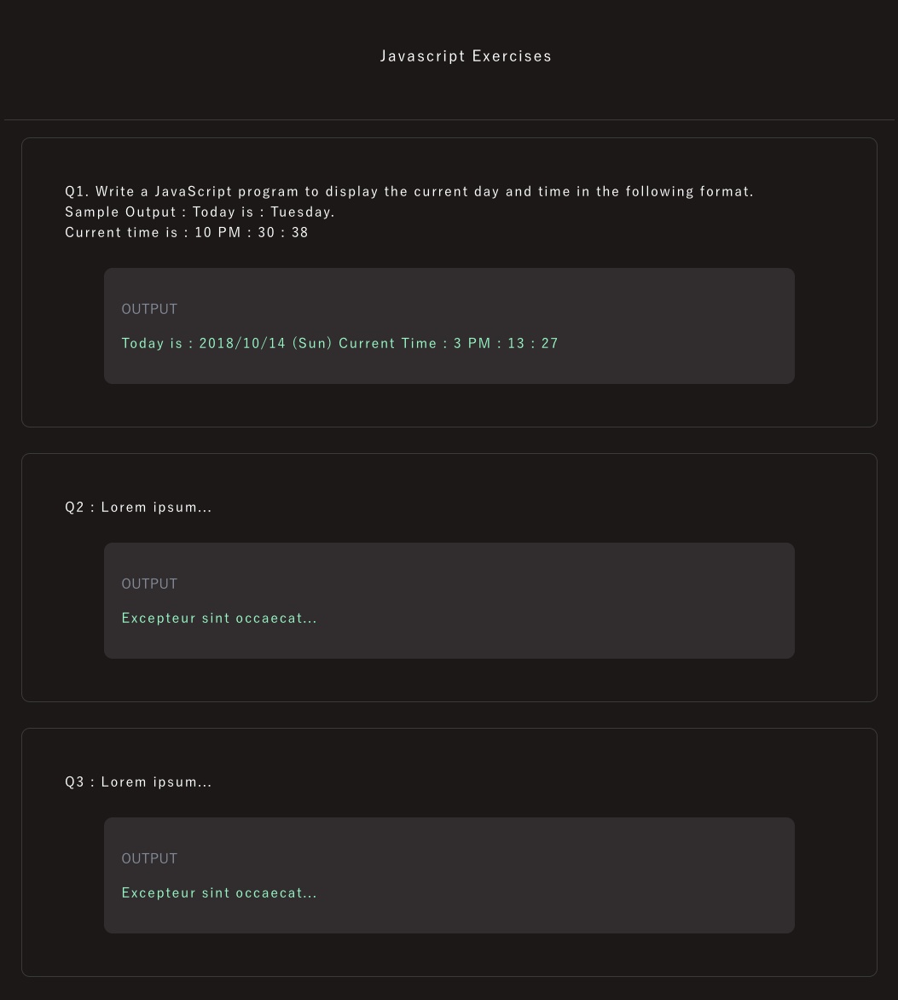

# What is quizComponentGenerator?

"quizComponentGenerator" is a function of Javascript.
This function generates html tags like this,


```html
<div class="question-container">
  <div class="question-desc">
  ...(input text)
  </div><div class="output-container">

  <div class="output-container">
    <p class="output-title">OUTPUT</p>
    <p class="output-text">
    ...(output text)
    </p>
  </div>
</div>
```


```js

// Generate a component for the excercise
function quizComponentGenerator(inputText,outputText){

  // create 'div' with a class name for the Question-Text
  let div = document.createElement('div');
  div.setAttribute("class", "question-container");

  // create 'div' with a class name
  let divQueationText = document.createElement('div');
  divQueationText.setAttribute("class", "question-desc");
  divQueationText.innerHTML = inputText;

  //append a child
  div.appendChild(divQueationText);

  // create 'div' with a class name for the output
  let divOutput = document.createElement('div');
  divOutput.setAttribute("class", "output-container");
  div.appendChild(divOutput);

  let p_title = document.createElement('p');
  p_title.setAttribute("class", "output-title");
  p_title.innerHTML = "OUTPUT";
  let p_output = document.createElement('p');
  p_output.setAttribute("class", "output-text");
  p_output.innerHTML = outputText;

  divOutput.appendChild(p_title);
  divOutput.appendChild(p_output);

  document.body.appendChild(div);

}
```




# How to use it?
